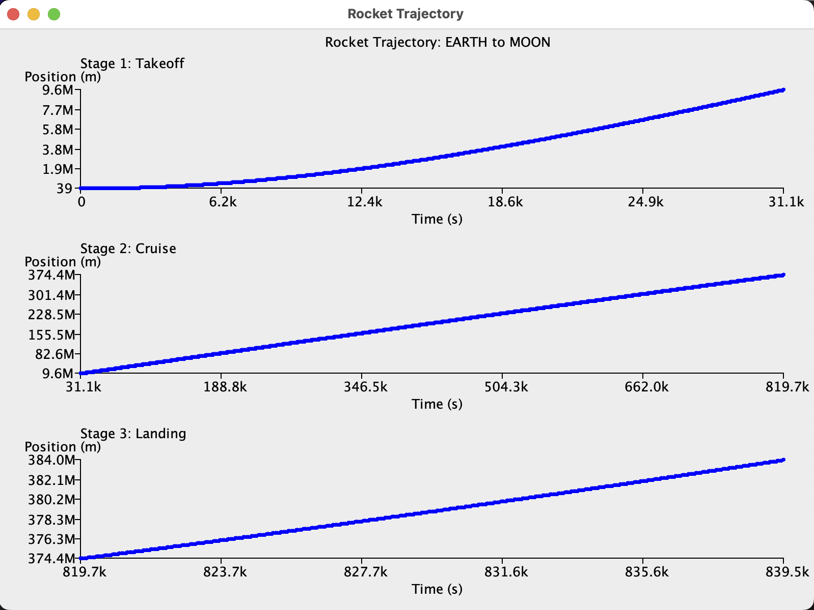
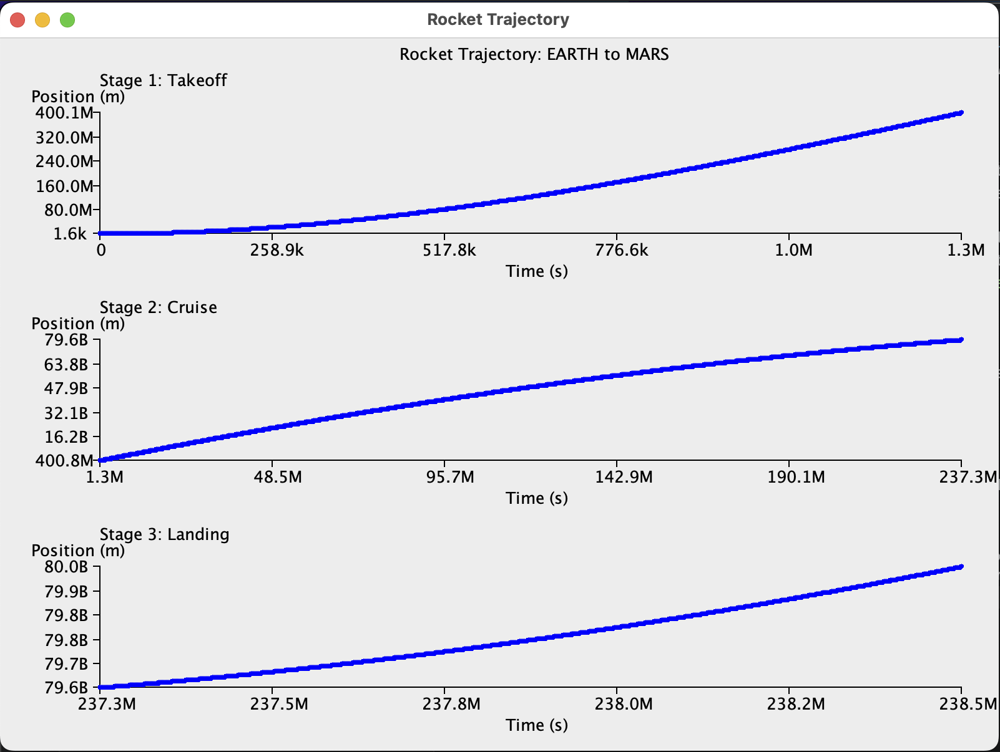

# FOOD Final

To Infinity and Beyond! Simulating a Rocket Travelling Through Space and Planets 
Team Members: Donald Morris, Ayush Kamath

## Overview

Our project is a physics-based simulation of a rocket going through space from the launch from one celestial body to the landing on another(Pick between Earth, Moon, Mars). We selected this idea because of the unique variables we could change, like gravity, air resistance, mass of the rocket, and how much fuel the rocket has. The target audience would be those attempting to learn more about rockets and resource management, as it is meant to show how well the rocket will do with the given amount of fuel. The user will interact with the rocket by inserting the planet of take-off, how much fuel there is, and the planet of landing, all through the terminal. As the rocket moves, the program prints updates about what stage it's in (liftoff, coasting through space, or landing), and at the end shows graphs of how the rocket moved over time. The simulation runs in 1-D, so the path between two planets is treated as a straight line. This rocket is useful for those interested in space-flight as it provides useful information about the amount of fuel needed for a rocket and how long the trip would take. 

## Screenshots





## Features

1. User inputted start and end location for the rocket, along with the fuel the rocket has for the journey.
2. A detailed list of when the rocket does things like exit orbit, re-enter orbit, and land.
3. Printed results on if the rocket successfully made it to it's destination.
4. A graph showing the path of the rocket on a 1D scale, with separate sub-plots for takeoff, cruise, and landing.
5. Tracks the usage of fuel and crashes the ship if it ever reaches 0.
> This has been done differently than mentioned in the proposal, now use a method in simulation while the state is in STAGE ONE.

## Project Structure

```
FinalProject/
├── src/
│   ├── Main.java        — terminal input prompts and the run-again loop
│   ├── States.java      — Planet/Stage enums and state-transition rules
│   ├── Simulate.java    — Euler physics loop, fuel/crash logic, summary printout
│   ├── Rocket.java      — rocket's physical state (position/velocity/mass/fuel)
│   └── GraphPanel.java  — Swing window drawing three trajectory sub-plots
├── resources/
│   ├── EarthToMoon.png
│   └── EarthToMars.png
└── README.md
```

## How to Build and Run

From the project root:

    javac src/*.java
    java -cp src Main

Then follow the User Guide below.

## Limitations

The program currently only holds three planets (Earth, Moon, Mars) and the simulation runs in 1-D, not full 2D orbital mechanics.

## User Guide

1. Run the Main.java file
2. Input one of available planets (MARS, MOON, or EARTH) as the rocket's start location.
3. Input a DIFFERENT planet (MARS, MOON, or EARTH) as the rocket's ending location.
4. Input the amount of fuel (in L) the rocket has.
5. Observe the printed data about the rocket's journey and the graph window.
6. Close the graoh window and return to the terminal.
7. Input the word "yes" to run the simulation again or the word "no" to exit the simulation. If you inputted "yes", start from the step 2.
